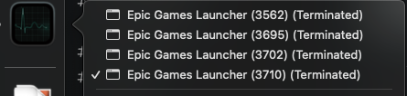
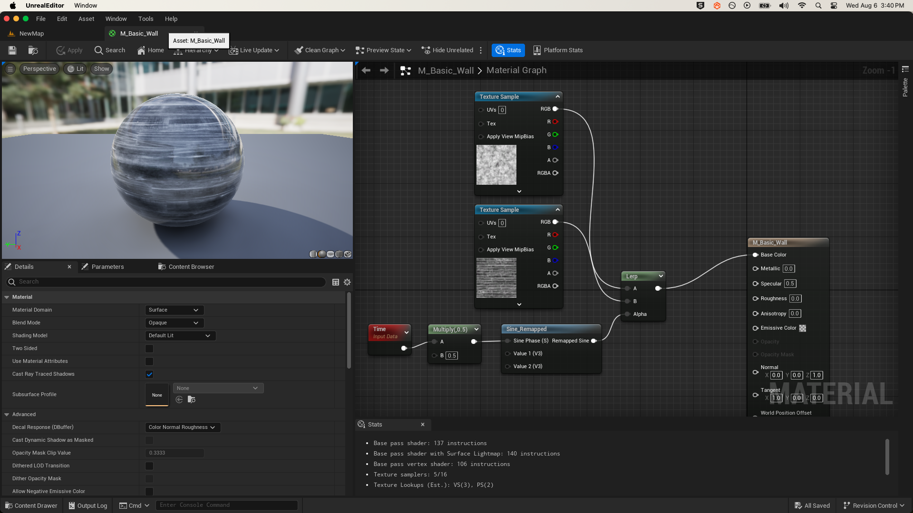
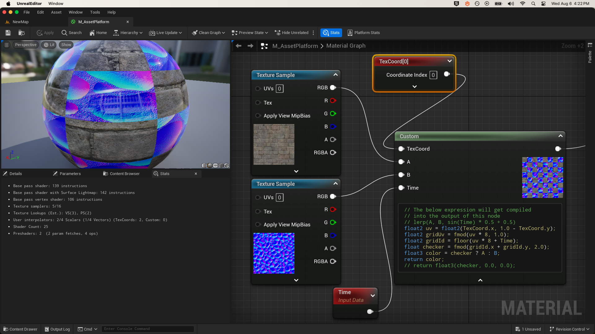
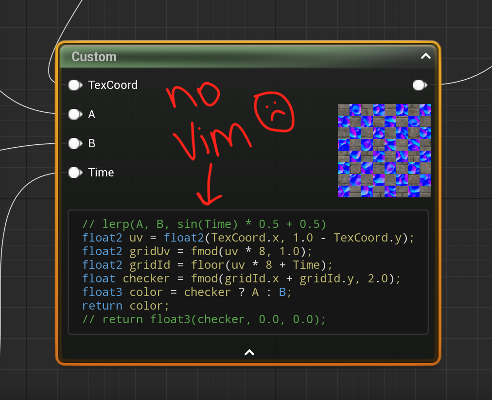
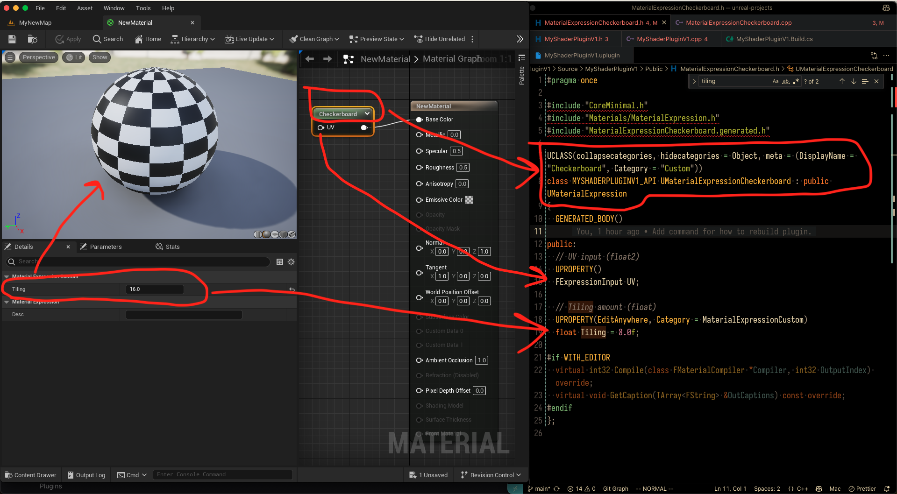
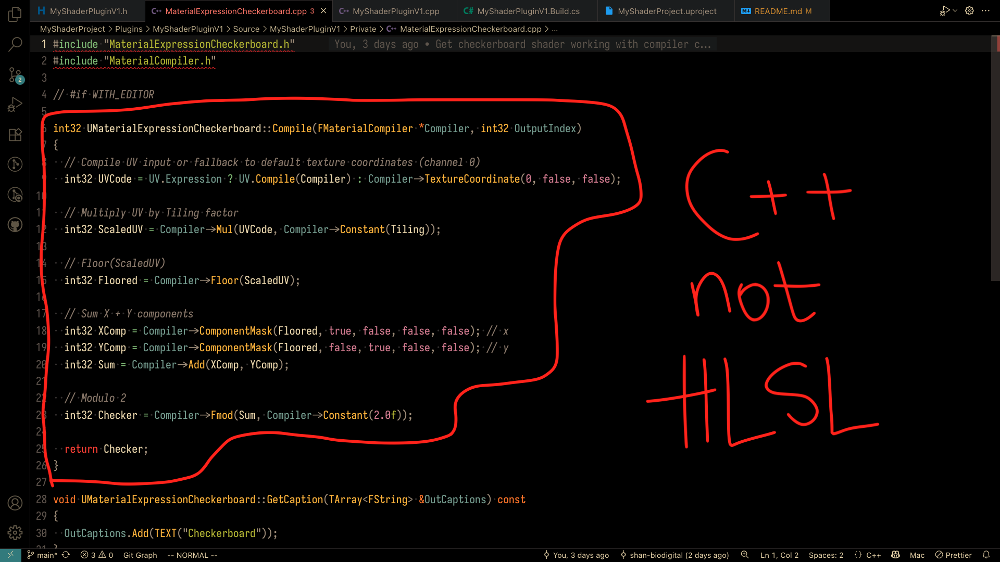
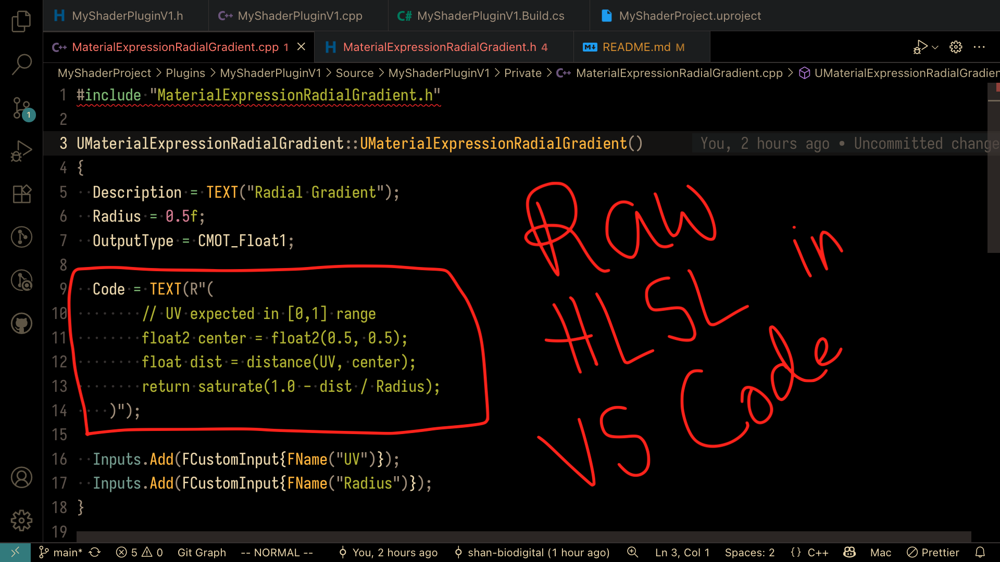
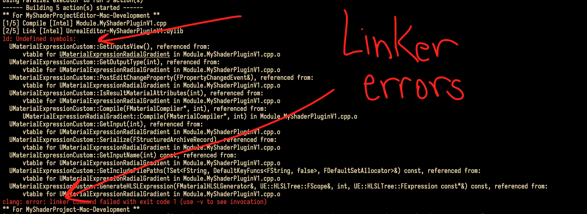

# Unreal Shader Project

# Overview

Started looking into Unreal and how we could create custom HLSL shaders. I'm still getting used to to engine (since I never used it before) and ran into lots of compiler errors, but managed to make some progress.

# Technical Details

### Installing Unreal

First, I needed to install the Unreal engine, but kept running into errors while trying to instal the Epic Games Store. Just glad I was (eventually) able to install it, and that it runs (at all) on my 2019, Intel chip, Mac. Here's the error that I kept getting, not sure if your team faced this before (but I got past it so no worries).



---

### Starting off with a lerp shader

Then, I wanted to create the simplest material shader to learn the basics. Here's a material that interpolates between 2 textures based on remapped sin. Had some experience with Unity shader graph, so this wasn't too bad.



---

### Writing custom HLSL Shader code

Then, I wanted to figure out how to write custom HLSL shader code (since it seemed to be the best place where a graphics engineer could help). Here's some shader code that creates a checkerboard pattern and uses it as a mask to switch between textures. Techinically, it's animated based on time, but I don't want to upload videos to GitHub. This was also pretty straightforward.



---

### Easy, but no Vim commands, or auto-complete...

Realized it is difficult to work out of the Custom Material Expression node (since no auto-complete, or vim commands, or EVEN keyboard shortcuts). Have ya'll run into this problem? Is there a fix?



---

### Maybe a C++ plugin can fix this (custom Checkerboard node)

Tried to solve this by making a custom C++ plugin with `UMaterialExpression`. Made an example with Checkerboard pattern that takes in customizable tiling values and outputs color. ChatGPT kinda slowed me down here because (presumably) it kept mixing up Unreal 4 code with Unreal 5 code. Anyway, eventually got it working.



---

### Uh oh, it requires writing (complex?) C++ compiler code

However, the problem with this approach seemed to be that I need to write (complex?) C++ compiler code. Not really the best developer experience (dx). Did your team figure out a way around this?



---

### Maybe there is a way forward with `UMaterialExpressionCustom`

I think the ideal approach for graphics engineers is to be able to write HLSL code directly in VS Code, and then create some plugin that artists can install and use. My thinking is that the artist + eng would agree on inputs values + outputs values, and the eng/tech artist does the HLSL/math coding?

Using `UMaterialExpressionCustom` seemed like the way to go (not `UMaterialExpression`). The former allows engineers to write custom HLSL code while the latter seems to require C++ compiler code.

Still not ideal because it's using raw text instead of an HLSL file, but that can be fixed if I could get this working.



### Compiler errors!

Unfortunately, I kept running into linker errors when compiling the code. Tried debugging this (obviously), but got stuck. Have you or your team seen this before? Is there a workaround?



---

### More involved approach to solve this problem?

Another approach that I saw was that engineers could create `.usf` files (basically Unreal’s version of HLSL) and draw to render targets. Seems like this required more C++ setup which I haven’t fully explored yet.

I'm happy to learn how to do this, but I'm mainly not sure how to prioritize my work between Unreal (C++), Maya (Python), 3D Web Engine (WebGL, Typescript). Way too much to context switch between lol.


---

### Let's go back to the basics + write HLSL code in the Material editor

All this led me back to using the Custom Material Expression node in the material editor. Using it is kinda annoying, but it gets the job done for simple cases. We can create custom inputs, and even multiple outputs. And it seems to be the same node-based approach to create post-processing effects so maybe this is the way to go.

Note: Looks like it does not support defining functions inside the text editor itself. So it is a little more limited than I would've liked.

Here's a fun little ray marching example where SDF blends smoothly into a plane. Still pretty hard to work with since I can't just create helper functions so I expanded the functions (SDSphere, SmoothMin) out. (As always, gotta thank Inigo Quilez his work on SDFs.)


```HLSL
// inputs
// UV (tex coords)
// custom_y ()
// k (smoothing factor)

float2 uv = float2(UV.x, 1.0 - UV.y);
uv = (uv - 0.5) * 2.0;
float3 ro = float3(0, 0, -1);
float3 rd = normalize(float3(uv, 1));
float d = 100.0;
float td = 0.0;
float r = 0.25;
for (int i = 0; i < 40; i++) {
  float3 p = ro + rd * td;
  float3 c1 = float3(0, custom_y + 0.25, 0);
  float3 c2 = float3(0, 0, 0);
  float d1 = length(p - c1) - r;
  float d2 = length(p - c2) - r;
  float h = clamp(0.5 + 0.5 * (d2 - d1) / k, 0.0, 1.0);
  float m = lerp(d2, d1, h) - k * h * (1.0 - h);
  float d = m;
  // d = min(d, m);
  //d = d1;
  if (abs(d) < 0.001) {
    break;
  }
  if (td > 100.0) {
    break;
  }
  td = td + d;
}
float3 col = float3(0, 0, 0);
col.rg = uv;
col.rgb = float3(td, td, td) * 0.05;
return col;
```

# Questions

All this exploration gave me some questions.

I’m wondering what approach your team takes for writing and sharing custom HLSL shader code?

- Is it writing HLSL code directly in the material node editor?
- Is it with custom plugin in C++ code compiler code?
- Is it with custom plugin using `UMaterialExpressionCustom` nodes where user can write HLSL code?
- Is it with using the `.usf` approach with render targets which seems to require more C++ setup?
- Or somthing else?

Some of these approaches are pretty good. But the developer experience (dx) of writing shaders was not as smooth as working in Shadertoy.

- Is it just a pipedream to wish it could be better?
- Maybe, these are things your team already solved?
- Maybe, I just don't know enough about Unreal? (I remember that writing shaders in Unity was also pretty annoying.)

Finally, some more general questions.

- Is there any documentation on how to learn/use Unreal engine?
- Do's, and don'ts?
- My understanding is that each team using Unreal may have different list of best practices, so I'm curious if something like that exists for me to read or learn from.

# Commands

Leaving some commands here incase I ever pick this up again.

```bash
# seems like we need to remove binaries and intermediate folders first
# otherwise, Unreal does not actually do the build (which is very annoying)
make clean

# rebuild C++ code with the following command
# restarting Unreal is way too slow, especially if you run into any compiler errors
/Users/Shared/Epic\ Games/UE_5.4/Engine/Build/BatchFiles/RunUAT.sh BuildCookRun -project="/Users/<username>/Desktop/dev/unreal-projects/MyShaderProject/MyShaderProject.uproject"  -noP4 -platform=Mac -clientconfig=Development -serverconfig=Development -cook -allmaps -build
```
